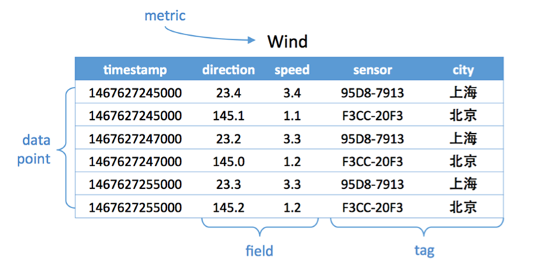

时序数据库
==========

时序数据是基于时间的一系列的数据。
在有时间的坐标中将这些数据点连成线，
往过去看可以做成多纬度报表，揭示其趋势性、规律性、异常性;往未来看可以做大数据分析，
机器学习，实现预测和预警。

时序数据库就是存放时序数据的数据库，
并且需要支持时序数据的快速写入、持久化、多纬度的聚合查询等基本功能。

对比传统数据库仅仅记录了数据的当前值，时序数据库则记录了所有的历史数据。
同时时序数据的查询也总是会带上时间作为过滤条件。

下面用一张图来说明时序数据库

概念：

- metric: 度量，相当于关系型数据库中的table。

- data point: 数据点，相当于关系型数据库中的row。

- timestamp：时间戳，代表数据点产生的时间。

- field: 度量下的不同字段。比如位置这个度量具有经度和纬度两个field。
  一般情况下存放的是会随着时间戳的变化而变化的数据。

- tag: 标签，或者附加信息。一般存放的是并不随着时间戳变化的属性信息。timestamp加上所有的tags可以认为是table的primary key。

如上图，度量为Wind，每一个数据点都具有一个timestamp，
两个field：direction和speed，
两个tag：sensor、city。它的第一行和第三行，
存放的都是sensor号码为95D8-7913的设备，属性城市是上海。
随着时间的变化，风向和风速都发生了改变，风向从23.4变成23.2;而风速从3.4变成了3.3。

参考文献：

#. https://www.sohu.com/a/237660940_130419