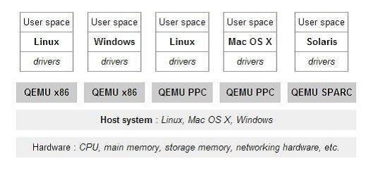
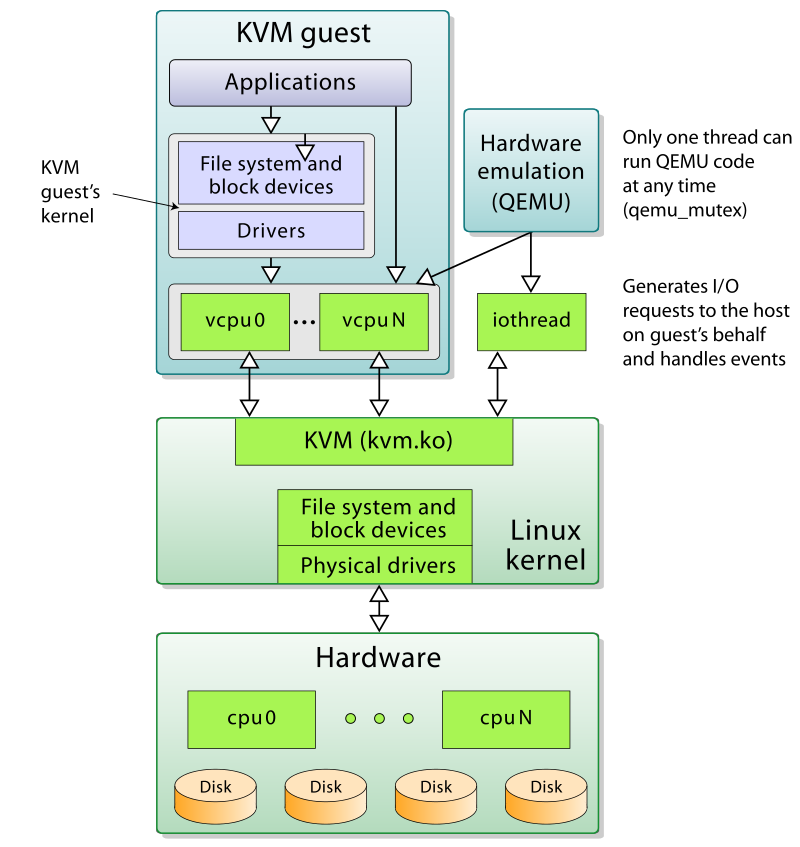

QEMU
====

什么是qemu
------------

qemu 官方的定义是: `QEMU is a generic and open source machine emulator and virtualizer.`
简单来说 qemu 就是用软件来模拟计算机的各种硬件, 使guest os认为自己和硬件直接打交道，
其实是和qemu模拟的硬件交互。qemu会将指令翻译给host执行。
所有指令通过qemu翻译后执行性能会比较差。qemu的架构如下图所示：

什么是KVM
----------

KVM实际上是linux内核提供的虚拟化架构，可以将内核直接充当hypervisor来使用。
KVM需要处理器硬件本身支持虚拟化扩展，例如intel VT 和 AMD AMD-V 技术。

KVM包含一个内核模块kvm.ko用来实现核心虚拟化功能，
以及一个和处理器强相关的模块如kvm-intel.ko或kvm-amd.ko。
KVM本身不实现任何模拟，仅仅是暴露了一个/dev/kvm接口，
这个接口可被宿主机用来主要负责vCPU的创建，虚拟内存的地址空间分配，
vCPU寄存器的读写以及vCPU的运行。有了KVM以后，
guest os的CPU指令不用再经过QEMU来转译便可直接运行，
大大提高了运行速度。但KVM的kvm.ko本身只提供了CPU和内存的虚拟化，
所以它必须结合QEMU才能构成一个完整的虚拟化技术，也就是下面要介绍的技术。

什么是QEMU-KVM
---------------

KVM负责cpu虚拟化+内存虚拟化，实现了cpu和内存的虚拟化，
但kvm并不能模拟其他设备，还必须有个运行在用户空间的工具才行。
KVM的开发者选择了比较成熟的开源虚拟化软件QEMU来作为这个工具，
QEMU模拟IO设备（网卡，磁盘等），对其进行了修改，最后形成了QEMU-KVM。

镜像基本操作
--------------

.. code-block:: console

   # 创建镜像
   $ qemu-img create -f <format> <filename> <size>

   # 查看镜像信息
   $ qemu-img info <filename>

格式转换
----------

.. code-block:: console

   $ qemu-img convert -c -f <fmt> -O <out_fmt> -o <options> <fname> <out_fname>

扩容
----

.. code-block:: console

   $ qemu-img resize test.img +2G

qemu-img 快照
----------------

.. code-block:: console

   # 创建快照
   $ qemu-img snapshot -c first_snapshot /var/lib/test.img

   # 查询快照
   $ qemu-img snapshot -l /var/lib/test.img
   Snapshot list:
   ID        TAG                 VM SIZE                DATE       VM CLOCK
   1         first_snapshot            0 2017-07-11 09:30:40   00:00:00.000

   # 使用快照
   $ qemu-img snapshot -a 1 /var/lib/test.img

   # 删除快照
   $ qemu-img snapshot -d 1 /var/lib/test.img

qemu 镜像修改
---------------

有时候当我们的qemu 镜像系统挂了或者是没有密码时，我们可以挂载qemu镜像，
然后对镜像进行修改和文件备份。操作步骤如下：

- 挂载qcow2

  .. code-block:: bash

     modprobe nbd max_part=8
     qemu-nbd -c /dev/nbd0 vdisk01.img
     mount /dev/nbd0p1 /mnt/

- 挂载lvm分区 qcow2镜像

  .. code-block:: bash

     vgscan
     vgchange -ay
     mount /dev/VolGroupName/LogVolName /mnt/

- 卸载qcow2

  .. code-block:: bash

     umount /mnt/
     vgchange -an VolGroupName
     killall qemu-nbd